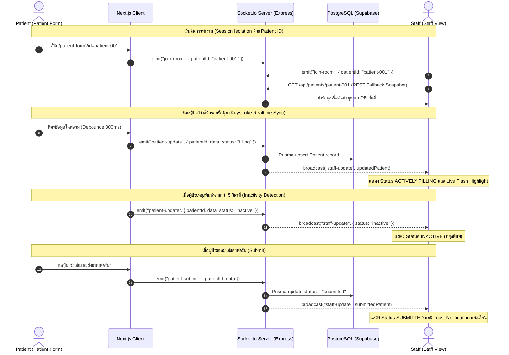

# Agnos Candidate Assignment — Patient Form & Staff Real-Time View

> ระบบแบบฟอร์มลงทะเบียนผู้ป่วยและหน้าจอมอนิเตอร์สำหรับเจ้าหน้าที่แบบ Real-Time ด้วย **Next.js 16 (App Router)**, **Tailwind CSS v4**, **Zustand**, **React Hook Form + Zod** เชื่อมต่อกับ Real-Time Backend ผ่าน **Socket.io** และ **PostgreSQL**

---

## ลิงก์ระบบใช้งานจริง (Live Deployments)

* **Frontend Application (Vercel):** `https://candidate-assignment-nanthapat.vercel.app` *(หรือ URL ที่คุณ Deploy)*
* **Real-Time Backend Service (Render):** `https://candidate-assignment-backend-nanthapat.onrender.com`
* **Health Check Endpoint:** `https://candidate-assignment-backend-nanthapat.onrender.com/health`
* **เอกสารการออกแบบเชิงลึก:** [docs/ARCHITECTURE.md](docs/ARCHITECTURE.md)

---

## 1. ฟังก์ชันการทำงานหลัก (Core Features)

1. **Patient Intake Form (`/patient-form`)**:
   * ครบทั้ง 12 ฟิลด์ข้อมูลตาม Requirement (ชื่อ, ชื่อกลาง, นามสกุล, วันเกิด, เพศ, เบอร์โทร, อีเมล, ที่อยู่, ภาษาที่สะดวก, สัญชาติ, ผู้ติดต่อฉุกเฉิน, ศาสนา)
   * ระบบ Validation ระดับฟิลด์ด้วย Zod และ React Hook Form
   * Keystroke Synchronization แบบ Debounced (300ms) ส่งข้อมูลไปหลังบ้านทันทีที่พิมพ์
   * ระบบตรวจจับการหยุดพิมพ์ (Inactivity Detection > 5s) และ Auto-Save Indicator

2. **Staff Real-Time View (`/staff-view`)**:
   * หน้าจอเฝ้าดูข้อมูลผู้ป่วยรายคนแบบ Real-Time (Session Isolation ด้วย Patient ID)
   * แสดง 3 สถานะการทำงาน: `ACTIVELY FILLING` (กำลังกรอก), `INACTIVE` (หยุดพิมพ์), `SUBMITTED` (ส่งข้อมูลแล้ว)
   * Live Flash Highlighting กะพริบแจ้งเตือนช่องที่มีการแก้ไขทันที
   * โหลด Snapshot ข้อมูลเริ่มต้นผ่าน REST API ป้องกันหน้าจอกระพริบ

3. **Forms Directory (`/forms`)**:
   * หน้ารวมรายการแบบฟอร์มคนไข้ทุก Session ในระบบ พร้อม Live Status Counter
   * ระบบค้นหา, กรองสถานะ, จัดเรียงลำดับ, และสลับมุมมอง Card / Table

4. **Split-Screen Demo (`/demo`)**:
   * หน้าจอแบ่ง 2 ฝั่ง (ซ้าย = คนไข้, ขวา = เจ้าหน้าที่) สำหรับการทดสอบและพรีเซนต์ระบบในหน้าเดียว

---

## 2. ข้อมูลส่วนของ Backend & API Specification

Real-Time Backend พัฒนาด้วย **Node.js + Express + Socket.io + Prisma ORM + PostgreSQL**

### WebSocket Events (Socket.io)

| Event Name | Direction | Payload | คำอธิบาย |
|---|---|---|---|
| `join-room` | Client ➔ Server | `{ patientId: string }` | เข้าร่วม Session Room ของคนไข้รายนั้น |
| `patient-update` | Client ➔ Server | `{ patientId, data, status }` | ส่งข้อมูลอัปเดตขณะกำลังพิมพ์ หรือเมื่อหยุดพิมพ์ |
| `patient-submit` | Client ➔ Server | `{ patientId, data }` | ส่งข้อมูลเมื่อกดยืนยันส่งแบบฟอร์ม |
| `staff-update` | Server ➔ Client | `PatientRecord` | แจ้งเตือนข้อมูลล่าสุดไปยังหน้าจอ Staff View |
| `patient-list-update`| Server ➔ Client | `PatientRecord` | แจ้งเตือนการเปลี่ยนแปลงไปยังหน้ารวมฟอร์ม (`/forms`) |
| `patient-deleted` | Server ➔ Client | `{ id: string }` | แจ้งเตือนเมื่อมีการลบ Session ผู้ป่วย |

### REST API Endpoints

```http
GET    /health             # Health Check สถานะของ Server
GET    /api/patients       # รายการผู้ป่วยทั้งหมด (รองรับ Search, Filter, Sort, Pagination)
GET    /api/patients/stats # สรุปตัวเลขสถิติจำนวนฟอร์มตามสถานะ
GET    /api/patients/:id   # ดึงข้อมูล Snapshot ของผู้ป่วยตาม ID
POST   /api/patients/seed  # โหลดชุดข้อมูลตัวอย่างเข้าสู่ Database
DELETE /api/patients/:id   # ลบข้อมูลผู้ป่วยตาม ID พร้อม Broadcast แจ้งเตือนทุก Client
```

---

## 3. แผนภาพการทำงาน Real-Time Synchronization (Diagram)



---

## 4. การติดตั้งและรันระบบ (Getting Started)

### 1. ติดตั้ง Dependencies (Frontend)
```bash
cd candidate-assignment-nanthapat
npm install
```

### 2. ตั้งค่า Environment Variables
สร้างไฟล์ `.env.local`:
```env
# สำหรับ Local Development:
NEXT_PUBLIC_SOCKET_URL=http://localhost:4000

# สำหรับเชื่อมต่อ Live Backend บน Render:
# NEXT_PUBLIC_SOCKET_URL=https://candidate-assignment-backend-nanthapat.onrender.com
```

### 3. รันโปรเจกต์ในโหมด Development
```bash
npm run dev
```
เปิดเบราว์เซอร์ไปที่: **`http://localhost:3000`**

---

## 5. การทดสอบและ Build ระบบ

```bash
# รัน Unit Tests ทั้งหมด (Vitest - 16 tests passing)
npm test

# ตรวจสอบ Linting (ESLint - 0 errors)
npm run lint

# Build สำหรับ Production
npm run build
```

---

## 6. เส้นทางหน้าต่างๆ (Application Routes)

* **หน้าหลัก (Landing Hub):** `http://localhost:3000`
* **หน้ารวมแบบฟอร์มทั้งหมด (Forms Directory):** `http://localhost:3000/forms`
* **หน้าฟอร์มกรอกข้อมูลผู้ป่วย:** `http://localhost:3000/patient-form?id=patient-001`
* **หน้าจอเฝ้าดูของเจ้าหน้าที่:** `http://localhost:3000/staff-view?id=patient-001`
* **หน้าจอจำลอง 2 ฝั่ง (Split-Screen Demo):** `http://localhost:3000/demo?id=patient-001`
