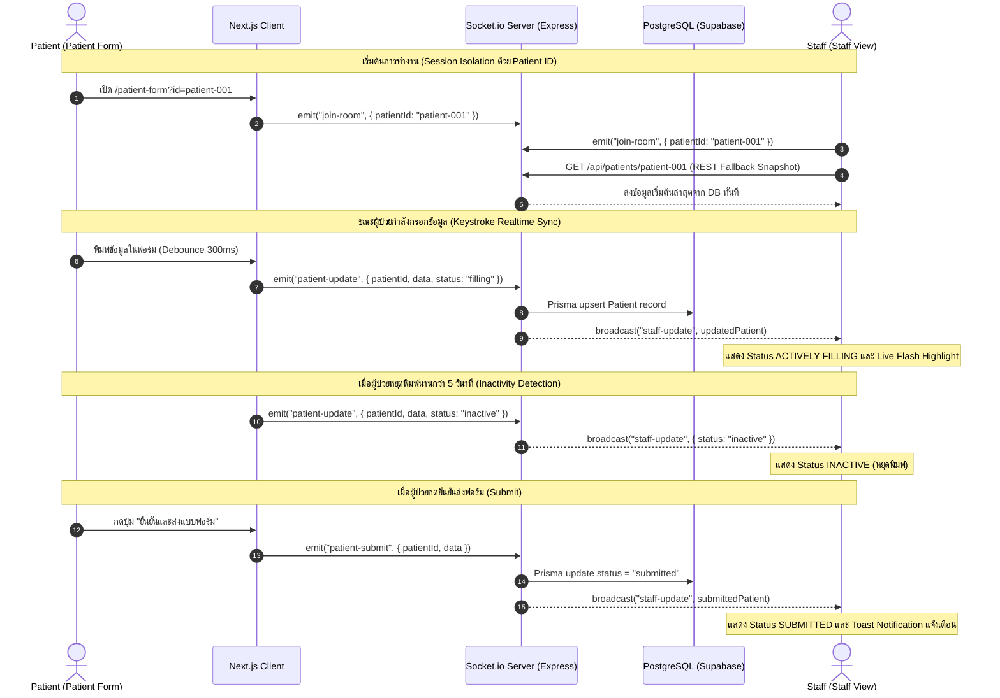

# Agnos Candidate Assignment — Patient Form & Staff Real-Time View

> **A responsive, real-time patient input form and hospital staff monitoring system built with Next.js 16 (App Router), Tailwind CSS v4, Socket.io, Zustand, and Zod.**

---

## สารบัญ (Table of Contents)
1. [ภาพรวมระบบ (Overview)](#1-ภาพรวมระบบ-overview)
2. [Tech Stack & สถาปัตยกรรม](#2-tech-stack--สถาปัตยกรรม)
3. [โครงสร้างโปรเจกต์ (Project Structure)](#3-โครงสร้างโปรเจกต์-project-structure)
4. [Component Architecture](#4-component-architecture)
5. [การออกแบบ UI/UX & ความ Responsive (Design Decisions)](#5-การออกแบบ-uiux--ความ-responsive-design-decisions)
6. [Real-Time Synchronization Flow](#6-real-time-synchronization-flow)
7. [ฟีเจอร์ระดับ Production & Bonus Features](#7-ฟีเจอร์ระดับ-production--bonus-features)
8. [การทดสอบ Unit Tests](#8-การทดสอบ-unit-tests)
9. [การติดตั้งและรันระบบ (Getting Started)](#9-การติดตั้งและรันระบบ-getting-started)

---

## 1. ภาพรวมระบบ (Overview)

ระบบประกอบด้วย 4 ส่วนการทำงานหลัก:
1. **Forms Directory (`/forms`)**: หน้ารวมรายการแบบฟอร์มคนไข้ทุก Session แบบ Real-Time พร้อมระบบค้นหา, กรองสถานะ, จัดเรียง, สลับมุมมอง Card/Table, ดู KPI Stats และปุ่มลัดเข้าถึงแต่ละฟอร์ม
2. **Patient Form (`/patient-form`)**: แบบฟอร์มกรอกข้อมูลผู้ป่วยแบบ Responsive ที่มีระบบ Real-Time Keystroke Sync (Debounced 300ms), Auto-Save Indicator, Form Validation ด้วย Zod และ Inactivity Detection
3. **Staff View (`/staff-view`)**: หน้าจอเฝ้าดูข้อมูลแบบ Real-Time สำหรับเจ้าหน้าที่ แสดงสถานะความเคลื่อนไหวของผู้ป่วย (`Actively Filling`, `Inactive`, `Submitted`), ไฮไลท์ช่องที่มีการเปลี่ยนแปลงแบบทันที (Live Flash Highlight) และโหลด Snapshot ข้อมูลเริ่มต้นผ่าน REST API
4. **Split-Screen Demo (`/demo`)**: หน้าจอพิเศษแบบแบ่ง 2 ฝั่ง (ซ้าย = คนไข้, ขวา = เจ้าหน้าที่) ช่วยให้กรรมการหรือผู้ประเมินสามารถทดสอบการพิมพ์และดูผลลัพธ์แบบเรียลไทม์ได้ในหน้าจอเดียว

---

## 2. Tech Stack & สถาปัตยกรรม

### Frontend Tech Stack
| ส่วนประกอบ | เทคโนโลยี | เหตุผลที่เลือก |
|---|---|---|
| **Framework** | Next.js 16 (App Router) + React 19 | SSR/CSR Hybrid, App Router Architecture, Turbopack Bundler |
| **Styling** | Tailwind CSS v4 | CSS Variables Design Tokens, Medical Theme (Teal/Emerald), Micro-animations |
| **Icons & UI** | Lucide React + Sonner | ไอคอนมาตรฐานสากล พร้อมระบบ Toast Notifications แจ้งเตือนสถานะ |
| **State Management** | Zustand | จัดการ Form State และ Socket Connection Lifecycle แบบ Type-safe เบาและเร็วกว่า Redux |
| **Form & Validation** | React Hook Form + Zod | Type-safe Schema Validation ตรวจสอบข้อมูลระดับ Field ทันที (Inline Validation) |
| **Real-time Client** | Socket.io-client | เชื่อมต่อ Persistent WebSocket พร้อมระบบ Auto-reconnect และ Fallback |
| **Testing** | Vitest + React Testing Library | Unit tests ตรวจสอบความถูกต้องของ Schema, Store, Custom Hooks, และ Components |

---

## 3. โครงสร้างโปรเจกต์ (Project Structure)

```
candidate-assignment-nanthapat/
├── __tests__/                         # Unit Tests (16 tests)
│   ├── components/
│   │   └── status-badge.test.tsx      # Test StatusBadge variants
│   ├── hooks/
│   │   └── useInactivity.test.ts      # Test Inactivity timer & countdown
│   ├── stores/
│   │   └── patient-form.store.test.ts # Test Zustand state management
│   └── validations/
│       └── patient.schema.test.ts     # Test Zod schema validation rules
├── app/                               # Next.js App Router
│   ├── demo/
│   │   └── page.tsx                   # Split-Screen Live Demo
│   ├── forms/
│   │   └── page.tsx                   # All Forms Directory & Management
│   ├── patient-form/
│   │   └── page.tsx                   # Patient Intake Form
│   ├── staff-view/
│   │   └── page.tsx                   # Staff Real-Time View
│   ├── globals.css                    # Design Tokens & Keyframe Animations
│   ├── layout.tsx                     # Fonts (Inter + Noto Sans Thai) & Toaster
│   └── page.tsx                       # Landing & Session Hub
├── components/
│   ├── common/
│   │   └── navbar.tsx                 # Global Navigation Bar with active states
│   ├── patient/                       # Patient Form specific components
│   │   ├── auto-save-indicator.tsx    # Live sync / saved / offline status badge
│   │   ├── contact-info-section.tsx   # Phone, Email, Address, Language
│   │   ├── emergency-section.tsx      # Emergency Contact (Name, Relation)
│   │   ├── personal-info-section.tsx  # Name, DOB, Gender, Nationality, Religion
│   │   └── submit-success.tsx         # Success screen with Confetti & Summary
│   ├── staff/                         # Staff View specific components
│   │   ├── connection-status.tsx      # Live WebSocket connection indicator
│   │   ├── last-updated-timer.tsx     # Auto-updating relative time (e.g. 2s ago)
│   │   ├── live-field-card.tsx        # Card with flash highlight animation on change
│   │   └── status-badge.tsx           # Filling (pulse), Inactive, Submitted
│   └── ui/                            # Atomic UI primitives
│       ├── badge.tsx
│       ├── button.tsx
│       ├── card.tsx
│       ├── input.tsx
│       ├── label.tsx
│       ├── select.tsx
│       └── separator.tsx
├── hooks/
│   ├── useInactivity.ts               # Inactivity detection hook (5s idle countdown)
│   └── useSocket.ts                   # Socket.io connection & room lifecycle hook
├── lib/
│   ├── socket.ts                      # Singleton Socket.io client manager
│   ├── utils.ts                       # Tailwind merge & date formatting helpers
│   └── validations/
│       └── patient.schema.ts          # Zod validation schema
├── stores/
│   ├── patient-form.store.ts          # Zustand store for form data & dirty states
│   └── socket.store.ts                # Zustand store for socket connection state
├── types/
│   └── patient.ts                     # Shared TypeScript interfaces & types
├── public/
│   └── manifest.json                  # PWA Web App Manifest
├── vitest.config.ts                   # Vitest configuration
└── README.md
```

---

## 4. Component Architecture

```
                               ┌───────────────────────────┐
                               │       Root Layout         │
                               │ (Inter + Noto Sans Thai)  │
                               └─────────────┬─────────────┘
                                             │
                      ┌──────────────────────┼──────────────────────┐
                      ▼                      ▼                      ▼
             ┌─────────────────┐   ┌───────────────────┐   ┌─────────────────┐
             │  Patient Form   │   │    Staff View     │   │   Split Demo    │
             │ (/patient-form) │   │   (/staff-view)   │   │     (/demo)     │
             └────────┬────────┘   └─────────┬─────────┘   └────────┬────────┘
                      │                      │                      │
     ┌────────────────┴───────────────┐      │                      │
     │ - PersonalInfoSection          │      │                      │
     │ - ContactInfoSection           │      │                      │
     │ - EmergencySection             │      │                      │
     │ - AutoSaveIndicator            │      │                      │
     │ - SubmitSuccessScreen          │      │                      │
     └────────────────────────────────┘      │                      │
                                             │                      │
                       ┌─────────────────────┴──────────────┐       │
                       │ - StatusBadge (Filling/Inactive/Sub)│◄──────┤
                       │ - LiveFieldCard (Highlight flash)  │       │
                       │ - ConnectionStatus (Live ping)     │       │
                       │ - LastUpdatedTimer (Relative time) │       │
                       └────────────────────────────────────┘       │
                                             ▲                      │
                                             │  Zustand Stores      │
                                             ├──────────────────────┘
                                             ▼
                                  ┌─────────────────────┐
                                  │ - patient-form.store│
                                  │ - socket.store      │
                                  └─────────────────────┘
```

---

## 5. การออกแบบ UI/UX & ความ Responsive (Design Decisions)

### 1. Mobile-First Approach (ฝั่งคนไข้)
* คนไข้ส่วนใหญ่เปิดลิงก์ฟอร์มจากมือถือหรือแท็บเล็ต จึงออกแบบให้ **Touch Target มีขนาดอย่างน้อย 44px**, ตัวหนังสือขนาดพอเหมาะ, Form field แบ่งเป็น **3 การ์ดหมวดหมู่** ชัดเจนไม่ให้รู้สึกแน่นจอ
* มี **Auto-Save Indicator** อยู่มุมบนเพื่อสร้างความมั่นใจให้ผู้ป่วยว่าข้อมูลถูกบันทึกอัตโนมัติ ไม่สูญหาย

### 2. Desktop Monitoring Dashboard (ฝั่งเจ้าหน้าที่)
* จัดวางแบบ **Multi-column Grid Layout** เพื่อให้เจ้าหน้าที่เห็นภาพรวมทุก Field ของคนไข้ได้ในหน้าจอเดียวโดยไม่ต้องเลื่อนบ่อย
* **Live Field Highlighting**: เมื่อคนไข้พิมพ์แก้ช่องใด ช่องนั้นบนจอ Staff จะมีแสง Highlight สีฟ้า/เขียววาบขึ้นมาเบาๆ ช่วยดึงสายตาเจ้าหน้าที่ไปยังจุดที่กำลังเปลี่ยนแปลง

### 3. มาตรฐานการเข้าถึง (WCAG 2.1 AA Accessibility)
* ทุก Input มี `<Label htmlFor="...">` ที่จับคู่ชัดเจน
* มี `aria-invalid`, `aria-describedby` และ `role="alert"` สำหรับข้อความแจ้งเตือนข้อผิดพลาด
* Contrast ของข้อความและพื้นหลังผ่านเกณฑ์ความคมชัด ≥ 4.5:1
* รองรับ Keyboard Navigation (Tab Order สมบูรณ์)

---

## 6. Real-Time Synchronization Flow



---

## 7. ฟีเจอร์ระดับ Production & Bonus Features

| ฟีเจอร์ | คำอธิบาย |
|---|---|
| **Debounced Keystroke Sync (300ms)** | หน่วงเวลาส่งข้อมูล 300ms เพื่อลดภาระ Network แต่ยังคงความเรียลไทม์ระดับพิมพ์เห็นผลทันที |
| **Inactivity Detection (5s Timer)** | ตรวจจับการหยุดพิมพ์เกิน 5 วินาที และส่งสถานะ `inactive` ไปยังหน้าจอ Staff อัตโนมัติ |
| **Split-Screen Demo Mode (`/demo`)** | หน้าจอจำลอง 2 ฝั่งในหน้าเดียว สำหรับพรีเซนต์และทดสอบโดยไม่ต้องเปิดหลายแท็บ |
| **Zod + React Hook Form Validation** | ตรวจสอบความถูกต้องของข้อมูล (Required fields, เบอร์โทร 10 หลัก, รูปแบบอีเมล) พร้อมแจ้งเตือนทันที |
| **REST API Snapshot Fallback** | Staff View จะดึงข้อมูลเริ่มต้นผ่าน `GET /api/patients/:id` ทันทีเมื่อเปิดหน้า เพื่อไม่ให้หน้าจอกระพริบขาวระหว่างรอ Socket |
| **One-Click Copy & Print** | ปุ่มสำหรับเจ้าหน้าที่ในการคัดลอกข้อมูลคนไข้ทั้งหมดลง Clipboard หรือสั่งพิมพ์รายงาน |
| **PWA Support** | มี `manifest.json` รองรับการติดตั้งแบบ Web App (Add to Home Screen) |

---

## 8. การทดสอบ Unit Tests

โปรเจกต์มีชุด Unit Tests ครอบคลุมทั้ง Schema Validation, Inactivity Timer, State Management, และ UI Components ด้วย **Vitest**:

```bash
# รัน Unit Tests ทั้งหมด
npm test
```

### ผลการทดสอบ (16 Tests Passed):
```
 ✓ __tests__/stores/patient-form.store.test.ts (4 tests)
 ✓ __tests__/validations/patient.schema.test.ts (6 tests)
 ✓ __tests__/hooks/useInactivity.test.ts (3 tests)
 ✓ __tests__/components/status-badge.test.tsx (3 tests)

 Test Files  4 passed (4)
      Tests  16 passed (16)
```

---

## 9. การติดตั้งและรันระบบ (Getting Started)

### 1. ติดตั้ง Dependencies
```bash
cd candidate-assignment-nanthapat
npm install
```

### 2. ตั้งค่า Environment Variables
สร้างไฟล์ `.env.local`:
```env
NEXT_PUBLIC_SOCKET_URL=http://localhost:4000
```
*(กรณีขึ้น Production บน Vercel ให้เปลี่ยน URL เป็นที่อยู่ Backend ของคุณ เช่น บน Railway/Render)*

### 3. รันโปรเจกต์ในโหมด Development
```bash
npm run dev
```
เปิดเบราว์เซอร์ไปที่: **`http://localhost:3000`**

### 4. เส้นทางหน้าต่างๆ (Routes):
* **หน้าหลัก (Landing Hub):** `http://localhost:3000`
* **หน้ารวมฟอร์มทั้งหมด (Forms Directory):** `http://localhost:3000/forms`
* **หน้าฟอร์มคนไข้:** `http://localhost:3000/patient-form?id=patient-001`
* **หน้าจอเจ้าหน้าที่:** `http://localhost:3000/staff-view?id=patient-001`
* **หน้าเดโม 2 จอ (แนะนำ):** `http://localhost:3000/demo?id=patient-001`

---

## 10. Build สำหรับ Production
```bash
npm run build
npm start
```
