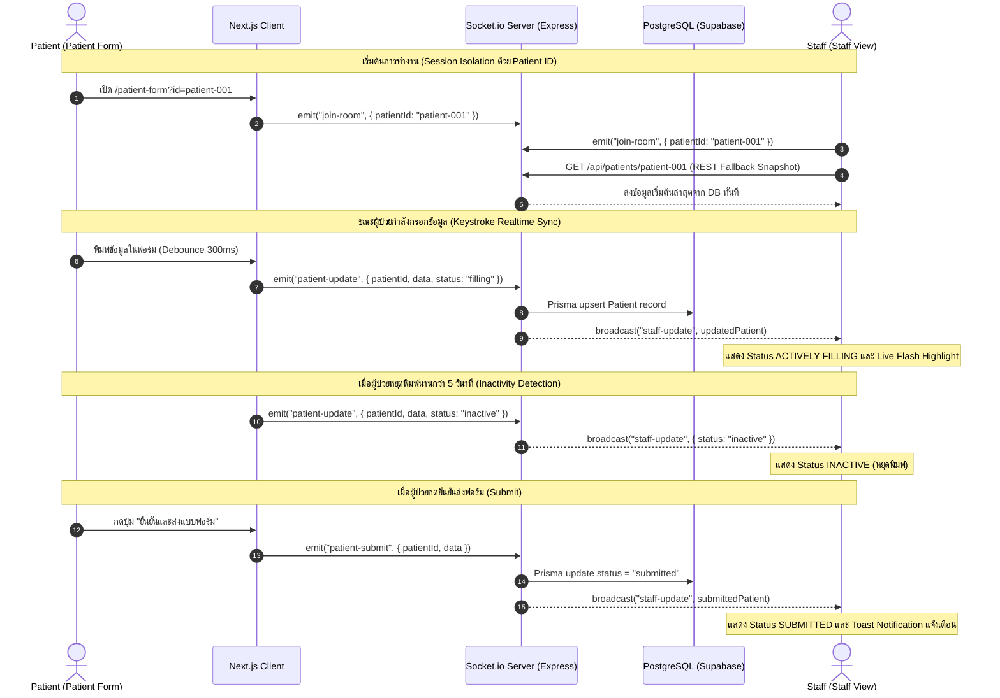

# สถาปัตยกรรมระบบและการออกแบบเชิงลึก (System Architecture & Design Decisions)

เอกสารนี้รวบรวมรายละเอียดทางเทคนิคเชิงลึก แผนผังการทำงาน การตัดสินใจด้าน UI/UX และการปฏิบัติตามมาตรฐานการเข้าถึง (Accessibility) สำหรับระบบ Real-Time Patient Intake & Staff Monitoring

---

## 1. โครงสร้าง Component Architecture

```
                               ┌───────────────────────────┐
                               │       Root Layout         │
                               │ (Inter + Noto Sans Thai)  │
                               └─────────────┬─────────────┘
                                             │
                      ┌──────────────────────┼──────────────────────┐
                      ▼                      ▼                      ▼
             ┌─────────────────┐   ┌───────────────────┐   ┌─────────────────┐
             │  Patient Form   │   │    Staff View     │   │   Split Demo    │
             │ (/patient-form) │   │   (/staff-view)   │   │     (/demo)     │
             └────────┬────────┘   └─────────┬─────────┘   └────────┬────────┘
                      │                      │                      │
     ┌────────────────┴───────────────┐      │                      │
     │ - PersonalInfoSection          │      │                      │
     │ - ContactInfoSection           │      │                      │
     │ - EmergencySection             │      │                      │
     │ - AutoSaveIndicator            │      │                      │
     │ - SubmitSuccessScreen          │      │                      │
     └────────────────────────────────┘      │                      │
                                             │                      │
                       ┌─────────────────────┴──────────────┐       │
                       │ - StatusBadge (Filling/Inactive/Sub)│◄──────┤
                       │ - LiveFieldCard (Highlight flash)  │       │
                       │ - ConnectionStatus (Live ping)     │       │
                       │ - LastUpdatedTimer (Relative time) │       │
                       └────────────────────────────────────┘       │
                                             ▲                      │
                                             │  Zustand Stores      │
                                             ├──────────────────────┘
                                             ▼
                                  ┌─────────────────────┐
                                  │ - patient-form.store│
                                  │ - socket.store      │
                                  └─────────────────────┘
```

---

## 2. การออกแบบ UI/UX & มาตรฐานความ Responsive

### 1. Mobile-First Approach (ฝั่งคนไข้)
* **Touch Target Size**: ปุ่มและ Input ทุกช่องมีขนาดขั้นต่ำ 44x44px เหมาะสำหรับการใช้งานผ่านสมาร์ตโฟน
* **Visual Chunking**: แบ่งกลุ่มข้อมูลเป็น 3 การ์ดหลัก (ข้อมูลส่วนตัว, ข้อมูลการติดต่อ, บุคคลติดต่อฉุกเฉิน) เพื่อลด Cognitive Load
* **Auto-Save Indicator**: แสดงสถานะการบันทึกอัตโนมัติแบบเรียลไทม์ (กำลังซิงค์ / บันทึกแล้ว / ออฟไลน์)

### 2. Desktop Monitoring Dashboard (ฝั่งเจ้าหน้าที่)
* **Multi-column Grid Layout**: จัดวางข้อมูลให้เห็นภาพรวมของคนไข้ทุกช่องในหน้าจอเดียว
* **Live Field Highlighting**: มี Effect แสงกะพริบแจ้งเตือนทันทีที่มีการเปลี่ยนแปลงข้อมูลในแต่ละฟิลด์

### 3. มาตรฐานการเข้าถึง (WCAG 2.1 AA Accessibility)
* ทุก Form Control มี `<Label htmlFor="...">` กำกับชัดเจน
* มี `aria-invalid`, `aria-describedby`, และ `role="alert"` สำหรับ Error Message
* Color Contrast Ratio ผ่านเกณฑ์ความคมชัด ≥ 4.5:1
* รองรับ Keyboard Navigation (Tab Order สมบูรณ์)

---

## 3. Real-Time Synchronization Sequence Diagram


